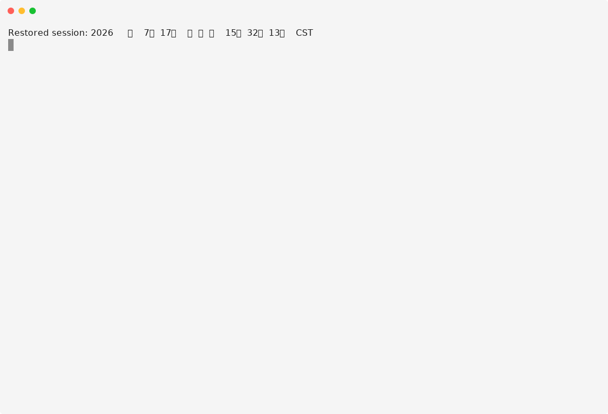

# zcode-app-cli

[](https://www.npmjs.com/package/zcode-app-cli)
[](./LICENSE)

Unofficial terminal client for the official agent runtime shipped with ZCode Desktop.

The project extracts the upstream `resources/glm` runtime, injects a local
`@zcode/tui` implementation based on
[`@earendil-works/pi-tui`](https://github.com/earendil-works/pi/tree/main/packages/tui),
and launches it as a Node.js child process that directly inherits the user's
terminal.

This project is not affiliated with or endorsed by Z.ai. ZCode and its bundled
runtime remain subject to their upstream terms. Confirm that you are allowed to
redistribute the extracted runtime before publishing the npm package.



## Quick start

```bash
npm install -g zcode-app-cli@latest
zcode
```

On first launch, ZCode creates `~/.zcode/cli/config.json` (or
`%USERPROFILE%\.zcode\cli\config.json` on Windows) with credential-free
defaults. Choose one of the three model-access paths in
[Configuration](./docs/CONFIGURATION.md) before sending your first prompt.

## Table of contents

- [Quick start](#quick-start)
- [Install and update](#install-and-update)
- [Architecture](#architecture)
- [Features](#features)
- [Workspace integration](#workspace-integration)
- [Requirements](#requirements)
- [Configuration](#configuration)
- [Local development](#local-development)
- [Contributing](#contributing)
- [License](#license)

## Install and update

```bash
npm install -g zcode-app-cli@latest
# or
bun add -g zcode-app-cli@latest
```

Using `@latest` is intentional because the App-aligned release format uses a
SemVer prerelease segment such as `3.3.5-2`. The tag always points to the
newest validated App-plus-build release.

Interactive startup checks the npm `latest` tag at most once every 20 hours
per installed version and shows a cached newer version as a non-blocking
update card with the exact install command and release-notes link. CI
environments skip the check automatically. Set `ZCODE_DISABLE_UPDATE_CHECK=1`
or `NO_UPDATE_NOTIFIER=1` to disable it.

A normal installation requires only Node.js and has no native PTY addon or
postinstall build step.

## Architecture

```text
Node.js npm launcher (config / login / version metadata)
  └─ inherited stdin / stdout / stderr
      └─ official zcode.cjs agent runtime
          └─ local @zcode/tui adapter
              └─ @earendil-works/pi-tui
```

The official agent, model, session, tool, plugin, MCP, credential store and
provider-configuration logic remains in the extracted runtime. The local
package supplies the missing terminal interface and a narrow macOS callback
bridge for Z.AI's registered Desktop OAuth flow. Node.js starts the public npm
command and remains the compatibility host for the extracted upstream kernel.
The official runtime directly owns raw terminal mode, IME cursor placement and
resize handling; the launcher does not insert a second PTY or relay terminal
bytes.

## Features

**Editor and input.** pi-tui differential rendering with a CJK-aware
multi-line editor; slash-command and workspace-path completion; persisted
prompt history through ZCode's history API; `--no-color` and `NO_COLOR`
support.

**Streaming and conversation.** Streamed assistant text from official ZCode
session events; `/mode`, `/model`, `/resume`, `/plugins` and other upstream
slash commands; searchable model and reasoning-effort selectors, plus MCP and
workflow panels; status-bar-only Shift+Tab mode cycling
(`build` → `edit` → `yolo` → `plan`), Ctrl+N model and empty-prompt Tab effort
cycling; structured session-goal status in the right side of the turn footer;
animated active-turn timer with a static `ZCODE_TUI_REDUCED_MOTION=1`
fallback; responsive context-remaining and session-token metrics.

**Login and permissions.** `/login` setup choices with masked API-key entry,
redacted transcript/history and OAuth waiting state; suspended Z.AI browser
login with terminal restoration and an optional `ZCODE_TUI_LOGIN_CMD`
override; interactive tool-permission approval dialogs.

**Attachments and rich output.** Clipboard image attachments through Ctrl+V
or `/paste-image`, with a keyboard-selectable attachment row; compact tool
execution views with path, command, progress, result and image previews;
parent/child Agent tool trees with resumable subagent metadata and expandable
Prompt/Response details; syntax-highlighted Markdown code blocks with stable
streaming-block rendering; Pierre-style inline diffs with line numbers,
syntax highlighting, word-level changes and CJK wrapping; terminal-native
Mermaid previews with source fallback for unsupported or oversized diagrams.

**Inspection and navigation.** `/diff` browser for current Git changes and
per-turn file changes; `/context` prompt-composition, cache and context-usage
details; `/status` session, runtime, goal, MCP and workspace details;
`/activity` and `/tasks` for active tools and background tasks; searchable
transcript navigation with per-block expansion, selected-block copying and
`n`/`N` match traversal; persistent active-tool, background-task and open-plan
activity between the transcript and editor.

**Steering, rewind and notifications.** Active-turn steering, cancellation
and error reporting; double-Esc rewind with input-point selection and safe
conversation/workspace scopes; unfocused turn-completion notifications through
terminal-native OSC 9 or BEL, with optional desktop commands; `/copy`,
`/clear`, `/exit`, Ctrl+C and Ctrl+D handling with token usage and resume
guidance on exit.

## Workspace integration

### Referencing workspace files

Type `@` at the start of the prompt or after whitespace to open project file
completion. Continue typing a path, use Up/Down to choose a candidate, then
press Tab or Enter to insert it. Selecting a directory lets you continue with
the next path segment.

```text
Explain @README.md
Compare @src/index.ts with @"docs/design notes.md"
```

Suggestions come from the official ZCode runtime, stay inside the current
workspace and exclude common repository metadata and dependency directories.
Paths containing spaces are inserted in the quoted `@"..."` form.

### Active-turn input

While a regular agent turn is running, press `Enter` to send the current text
as same-turn steering. Until the official runtime reaches a safe model-step
boundary, the steer stays in a waiting row next to the editor instead of being
shown as committed conversation history. Once the runtime confirms injection,
the message moves into the transcript at its actual position and uses the normal
user-message `›` prefix. The `↪` marker is reserved for the temporary waiting
row.

To keep a follow-up editable instead, press `Tab` while the editor contains
text and completion is closed. The input remains in the local next-turn queue.
Queued inputs start in FIFO order after the active turn completes normally.
With an empty editor, press `Alt+Up` or `Shift+Left` to move the most recently
queued input back into the editor. Accepted steers cannot be edited because
they have already been handed to the official runtime, even while the waiting
row is visible; use `Tab` when the text must remain changeable. A steer rejected
or discarded before injection returns to the editable next-turn queue.

### Image attachments

Press `Ctrl+V` or run `/paste-image` to attach an image from the clipboard.
Pending images appear above the editor as complete `[Image #N]` tokens.
Submitting a prompt moves those images into that user turn immediately, so they
are removed from the pending row and cannot leak into the next prompt.

Move the editor cursor to the start of its first line and press `Up`, or run
`/attachments`, to focus the attachment row. While it is focused:

- `Left`/`Right` selects an image;
- `Backspace` or `Delete` removes the selected image and renumbers the rest;
- `Down`, `Esc`, `Ctrl+C`, or `Enter` returns to the editor without changing its text.

Run `/attachments clear` to remove every pending image at once. `Ctrl+D`
retains its terminal-standard empty-editor exit and forward-delete behavior.

### Conversation rewind

With an empty editor and no active turn, press `Esc` twice within 800 ms to
open the conversation rewind picker. Choose the user input to return to, review
the available workspace checkpoints, then select one of the available scopes:

- **Conversation only** removes later conversation turns, keeps workspace
  files unchanged, and restores the selected input to the editor;
- **Conversation and workspace** also restores safe checkpointed file changes;
- **Workspace only** restores safe checkpointed files without changing the
  conversation.

The scope picker only offers workspace restoration when the official ZCode
runtime reports a complete safe checkpoint plan. Files changed externally are
not overwritten, and Bash or terminal file mutations are reported as ignored
because they do not have restorable ZCode checkpoints. Press `Esc` in the scope
picker to return to input selection, then `Esc` again to close rewind.

### TUI inspection and navigation

```text
/diff                         browse current and per-turn file changes
/context                      inspect context usage and source composition
/status                       inspect detailed runtime and session status
/activity                     inspect every active tool and open task
/tasks                        inspect or stop background tasks
/search <text>                search retained transcript blocks
/search next|prev|clear       navigate or close transcript search
/transcript latest            select the latest transcript block
/transcript next|prev|close   navigate or leave transcript selection
/copy                         copy the selected block, or the latest response
```

While the editor is empty, `Alt+Up` and `Alt+Down` navigate selected transcript
blocks. `Ctrl+O` expands only the selected/search-matched block; without a
selection it toggles all expandable content. During transcript search, `n` and
`N` move to the next and previous match. `PageUp` and `PageDown` page through
an oversized selected block without rendering the entire message at once.
`Esc` leaves search or transcript navigation.

## Requirements

- Node.js 22.19 or newer;
- macOS, Linux or Windows on x64 or ARM64.

Z.AI browser OAuth currently requires macOS because the registered provider
callback is `zcode://zai-auth/callback`; API-key and custom-provider access work
on every supported platform.

Set `ZCODE_NODE=/absolute/path/to/node` when the desired Node.js executable is
not available on `PATH`.

## Configuration

ZCode reads configuration from `~/.zcode/cli/config.json` (or
`%USERPROFILE%\.zcode\cli\config.json` on Windows), with project-level
overrides from `zcode.json` or `.zcode/config.json` in the working directory.
Existing files are never replaced.

Three model-access paths are supported: Z.AI OAuth (macOS only), Z.AI/BigModel
Coding Plan API key, or a direct API key with a custom provider. For detailed
setup steps, retries/timeouts, theme, and turn-completion notifications, see
[Configuration](./docs/CONFIGURATION.md).

## Local development

Install dependencies and start the client with live TypeScript and auto-sync
from the local ZCode Desktop installation:

```bash
bun install
bun run dev
```

Run all validation layers:

```bash
bun run typecheck
bun test
bun run check
bun run check:tui
```

For the OAuth path, release workflow details, CI, and the full development
guide, see [Development](./docs/DEVELOPMENT.md). For maintainer-only release
and publishing workflows, see [Releasing](./docs/RELEASING.md).

## Contributing

Issues and pull requests are welcome at
[github.com/kingsword09/zcode-cli](https://github.com/kingsword09/zcode-cli).
Please open an issue first to discuss substantial changes. See
[Development](./docs/DEVELOPMENT.md) for the local setup and validation
commands, and [Releasing](./docs/RELEASING.md) for the release flow.

## License

MIT — see [LICENSE](./LICENSE).
